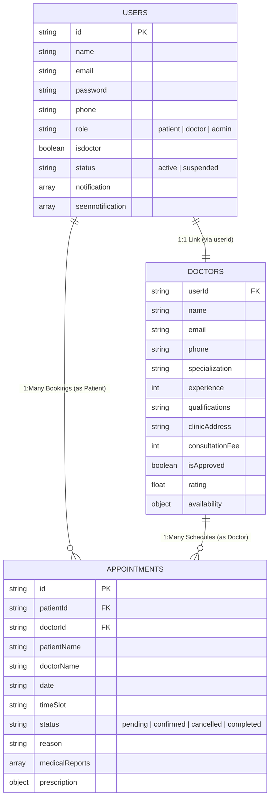

# Book a Doctor App – Technical Architecture & System Specification

This document contains the complete technical architecture, data schemas, user flows, and specification guidelines for the **Book a Doctor App**.

---

## 🏗️ Technical Architecture Overview

The Book a Doctor App features a modern full-stack architecture based on a client-server model:

*   **Frontend**: React.js utilizing Tailwind CSS and Lucide Icons for a responsive and intuitive user interface, with Axios handling seamless REST API communication.
*   **Backend**: Powered by Node.js and Express.js, implementing a robust MVC (Model-View-Controller) pattern to organize server-side logic cleanly.
*   **Database & Storage**: MongoDB/Mongoose (using a schema-validated, local JSON-backed document storage for sandbox environments) to store user profiles, active doctor profiles, and appointments securely.
*   **Authentication & Security**: State-managed stateless JWT (JSON Web Tokens) for session management, and `bcryptjs` for secure password hashing.
*   **File Management**: Integrated file uploading via safe `multer` rules supporting PDF and images.
*   **Date-Time Operations**: Handled via precise scheduling filters, preventing conflicts and double-bookings.

---

## 🗄️ Architectural Design Patterns

The Book a Doctor backend follows the **Model-View-Controller (MVC)** architectural pattern, which separates concerns into three distinct layers:

```text
                  +-------------------------+
                  |    Client (React UI)    |
                  +------------+------------+
                               |  Request / Response
                               v
                  +-------------------------+
                  |   View Layer (Routes)   |
                  +------------+------------+
                               |
                               v
                  +------------+------------+
                  |    Controller Layer     |
                  +------------+------------+
                               |
                               v
                  +------------+------------+
                  |  Model Layer (Database) |
                  +-------------------------+
```

### 1. Model Layer (Data Layer)
Responsible for handling all data-related logic, schema validations, and operations performed on the database. In local dev, this translates to structured TypeScript entities stored in our database engine.

### 2. Controller Layer
Acts as an intermediary between the routing/view layer and the models. It receives incoming HTTP requests, performs authentication checks, parses parameters, implements clinical business rules, and structures JSON responses.

### 3. View Layer (Routing Layer)
In a REST API, this is implemented as the routing layer, mapping specific HTTP verbs (`GET`, `POST`, `PUT`, `DELETE`) and URLs to their corresponding controller functions.

---

## 📊 Entity-Relationship (ER) Diagram

The system coordinates three primary collections/schemas to manage healthcare workflows:



### Collection Fields Detail:

1.  **Users Collection**:
    *   `id`: Unique identifier.
    *   `name`: Full name.
    *   `email`: Email address (unique login credential).
    *   `password`: BCRYPT encrypted hash.
    *   `phone`: Mobile contact details.
    *   `role`: Defines the portal views (`patient`, `doctor`, `admin`).
    *   `isdoctor`: Boolean toggle flagging if they are verified doctors.
    *   `status`: Controls account suspensions (`active`, `suspended`).
    *   `notification` / `seennotification`: Arrays storing in-app notifications.

2.  **Doctors Collection**:
    *   `userId`: Foreign key linking to the corresponding user account.
    *   `name` / `email` / `phone`: Mirrored doctor contact details.
    *   `specialization`: Medical area of expertise.
    *   `experience`: Years in clinical practice.
    *   `qualifications`: Diplomas and institutional credentials (e.g., AIIMS, NIMHANS).
    *   `clinicAddress`: Physical clinic location.
    *   `consultationFee`: Price represented in Indian Rupees (₹).
    *   `isApproved`: Vetting status (must be approved by Admin).
    *   `availability`: Weekly timetable and operating slots.

3.  **Appointments Collection**:
    *   `id`: Unique booking code.
    *   `patientId` / `patientName`: Links to the patient user record.
    *   `doctorId` / `doctorName`: Links to the practicing doctor record.
    *   `date`: Chosen visit date.
    *   `timeSlot`: Hour of session.
    *   `status`: Cycle state (`pending` ➔ `confirmed` / `cancelled` ➔ `completed`).
    *   `reason`: Symptoms described by patient.
    *   `medicalReports`: Uploaded diagnostic attachments.
    *   `prescription`: Digital prescription logged by the doctor.

---

## 👤 Detailed User Stories & Flows

### 1. User Registration Flow
*   **Actor**: Patient (John)
*   **Workflow**: John registers an account, entering his email, password, and contact details. On success, he is prompted to log in to access the Patient Dashboard.

### 2. Browsing & Filtering Doctors
*   **Actor**: Patient
*   **Workflow**: Once logged in, the patient views all approved clinical providers. He filters by medical specialization, max consultation fees, or searches by name to find a local specialist.

### 3. Booking an Appointment
*   **Actor**: Patient
*   **Workflow**: John selects Dr. Smith, enters the chosen date and time block, uploads his relevant medical files (PDF/Images), and submits. He receives an immediate booking confirmation under "Pending Review".

### 4. Appointment Vetting & Notification
*   **Actor**: Doctor
*   **Workflow**: Dr. Smith logs in, reviews the appointment request along with John's uploaded reports, and approves the booking. John's appointment status instantly transitions to "Scheduled", triggering an in-app notification.

### 5. Admin Approvals (Background)
*   **Actor**: Administrator
*   **Workflow**: Admin monitors newly registered doctors. Reviews medical credentials of pending doctors (e.g., Dr. Kabir Deshmukh) and approves them. Vetted doctors are instantly listed in the public directory.

---

## 🛠️ Codebase Structure & Component Map

| Component / Controller (Requested) | Implemented Type-Safe File Path | Description |
|---|---|---|
| `connectToDB.js` | `/src/server/db.ts` | JSON-backed DB Engine mimicking Mongoose APIs with autoseeder. |
| `AdminController.js` | `/src/server/controllers/adminController.ts` | Manage system users, toggle status, and fetch clinic statistics. |
| `DoctorController.js` | `/src/server/controllers/doctorController.ts` | Update doctor timetable, fetch doctor-specific appointments, and manage status. |
| `UserController.js` | `/src/server/controllers/authController.ts` & `appointmentController.ts` | Handlers for register, login, application, slot booking, and notifications. |
| `AuthMiddleware.js` | `/src/server/middleware/auth.ts` | JWT validation, role permission checks, and `userId` injection. |
| `AdminRoutes.js` / `DoctorRoutes.js` / `UserRoutes.js` | `/src/server/routes/api.ts` | REST Router registering endpoints cleanly with MVC controller hooks. |
| `UserModel.js` / `DocModel.js` / `AppointmentModel.js` | `/src/types.ts` & `/src/server/db.ts` | TypeScript Interfaces declaring valid structures and validations. |
| `App.js` | `/src/App.tsx` | Main Router mapping paths to Patient, Doctor, and Admin workspaces. |
| `AdminAppointment.jsx` | `/src/pages/AdminPortal.tsx` | Interactive admin viewport rendering user controls, vetting desk, and charts. |
| `Home.jsx` | `/src/pages/Home.tsx` | Public Landing Page with hero visualizers and specialty categories. |
| `Login.jsx` | `/src/pages/Login.tsx` | Login screen with pre-populated multi-role test accounts. |
| `Notification.jsx` | `/src/pages/PatientPortal.tsx` & `DoctorPortal.tsx` | Unified Notification manager allowing mark-as-read and clear actions. |
| `Register.jsx` | `/src/pages/Register.tsx` | Multi-role registration screen supporting Patients and Doctors. |
| `Applydoctor.jsx` | `/src/pages/Register.tsx` (or Patient Portal application drawer) | Application intake form collecting professional fees, timings, and credentials. |
| `DoctorList.jsx` | `/src/pages/DoctorDirectory.tsx` | Search engine with range-sliders, available days, and slot booking triggers. |
| `UserHome.jsx` | `/src/pages/PatientPortal.tsx` | Patient dashboard containing appointment history, printable summary, and health vault. |
